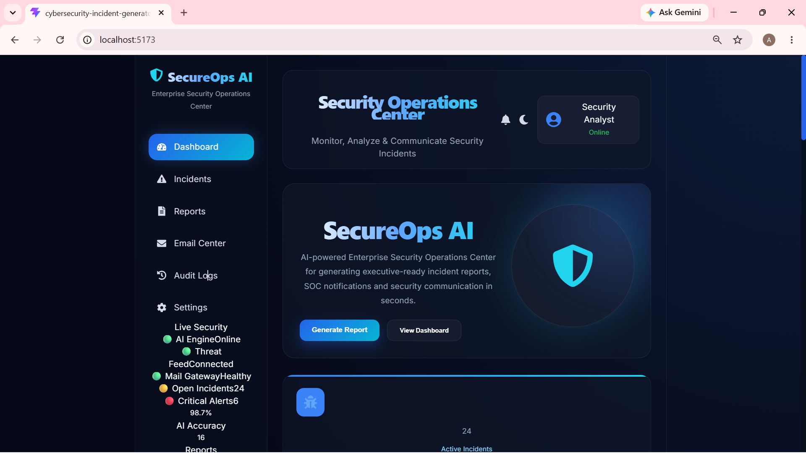
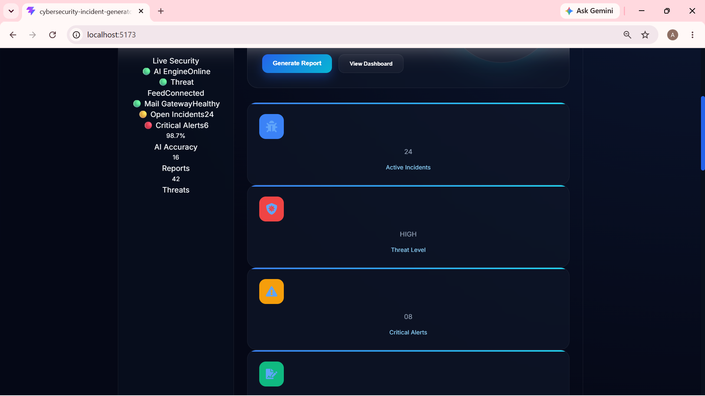
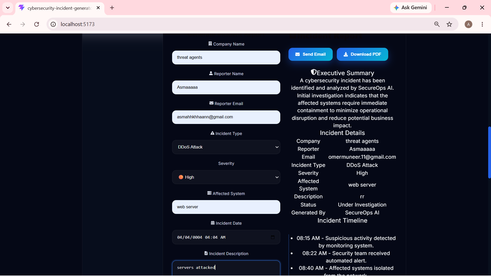
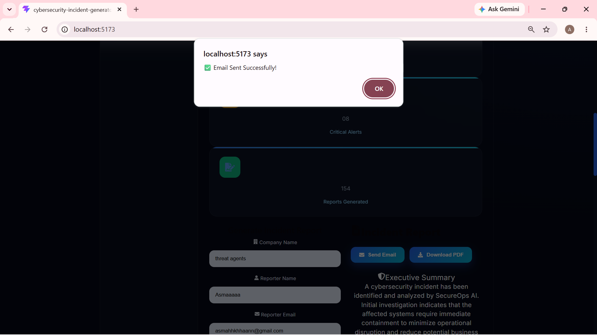

# 🔐 SecureOps AI

> **AI-Powered Cybersecurity Incident Report Generator**

SecureOps AI is a modern cybersecurity incident reporting application designed to help security teams generate professional incident reports, export them as PDF documents, and send automated email notifications through an intuitive SOC-inspired dashboard.

---

## 🚀 Project Overview

SecureOps AI streamlines the incident reporting workflow by allowing analysts to quickly document cybersecurity incidents, generate structured reports, export reports as PDFs, and automatically notify stakeholders via email.

The application is built with a modern frontend using React and Vite while providing a clean, responsive user experience inspired by real-world Security Operations Centers (SOC).

---

## ✨ Key Features

- 📊 Modern SOC Dashboard
- 📝 Incident Report Form
- 🤖 AI-style Incident Report Generation
- 📄 PDF Export using jsPDF
- 📧 Automated Email Notifications using EmailJS
- 🌙 Clean Dark Theme UI
- 📱 Responsive Design
- ⚡ Fast React + Vite Architecture

---

## 🛠️ Tech Stack

| Technology | Purpose |
|------------|---------|
| React | Frontend Framework |
| Vite | Build Tool |
| JavaScript | Application Logic |
| CSS3 | Styling |
| EmailJS | Email Notifications |
| jsPDF | PDF Report Generation |

---

## 📸 Project Screenshots

### 🖥️ Dashboard



---

### 📝 Incident Report Form



---

### 📄 AI Generated Incident Report



---

### 📧 Email Notification


---

## ⚙️ Installation

Clone the repository:

```bash
git clone https://github.com/asmakhann1956-hue/secureops-ai-elements.git
```

Navigate to the project directory:

```bash
cd secureops-ai-elements
```

Install dependencies:

```bash
npm install
```

Start the development server:

```bash
npm run dev
```

The application will be available at:

```
http://localhost:5173
```

---

## 📂 Project Structure

```
secureops-ai-elements
│
├── screenshots/
├── public/
├── src/
│   ├── assets/
│   ├── components/
│   ├── App.jsx
│   ├── main.jsx
│   └── index.css
│
├── package.json
├── vite.config.js
└── README.md
```

---

## 🔄 Workflow

1. Open the SecureOps AI dashboard.
2. Navigate to the Incident Form.
3. Enter incident information.
4. Generate the AI-powered incident report.
5. Export the report as a PDF.
6. Send an automated email notification using EmailJS.

---

## 🎯 Future Improvements

- AI-powered incident summarization
- Threat intelligence integration
- User authentication
- Incident history database
- SIEM integration
- Role-based access control
- Analytics dashboard
- Cloud deployment

---

## 🤝 Contributing

Contributions are welcome!

If you'd like to improve SecureOps AI:

1. Fork the repository
2. Create a new branch
3. Commit your changes
4. Submit a Pull Request

---

## 👨‍💻 Author

**Muhammad Taha Moatesim Billah**

Cybersecurity Student | SOC & Network Security Enthusiast

---

## ⭐ Support

If you found this project useful, consider giving it a ⭐ on GitHub.

---

## 📜 License

This project is created for educational, portfolio, and hackathon purposes.
